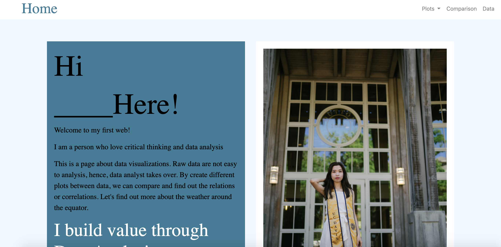
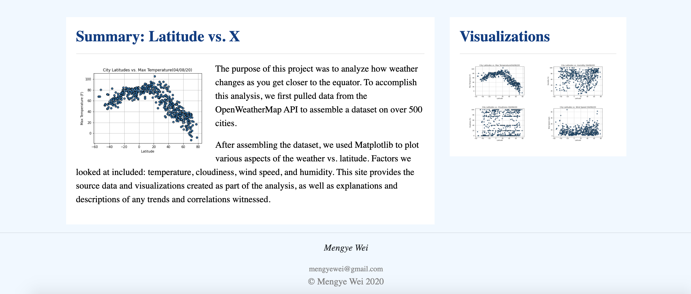
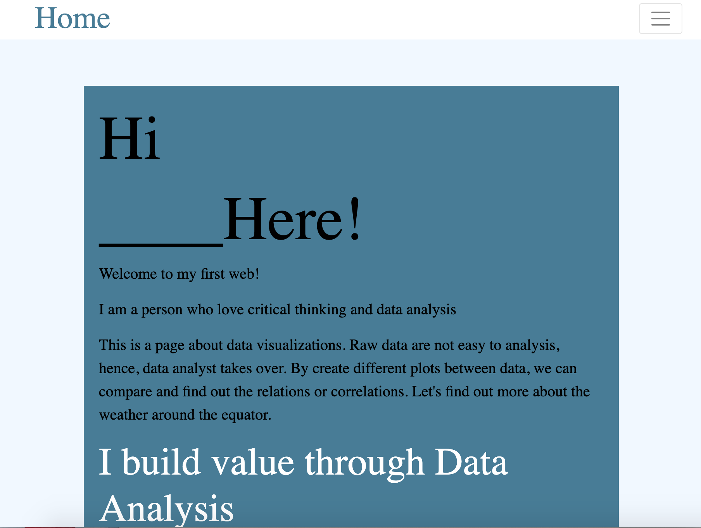
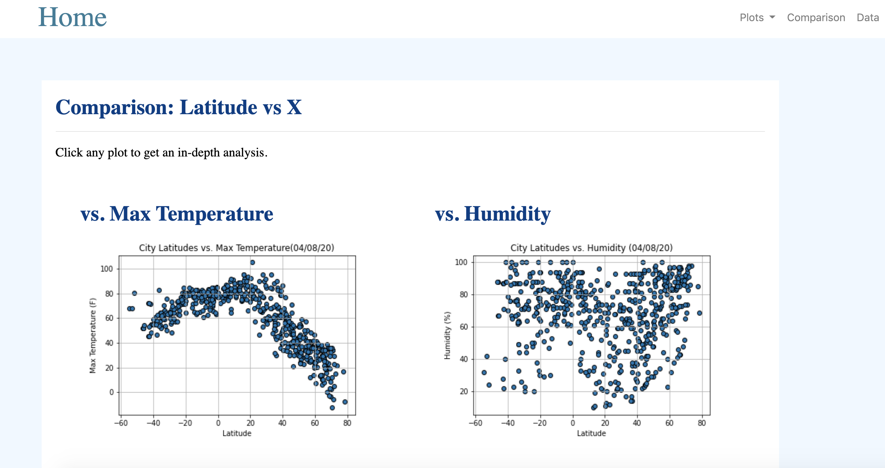
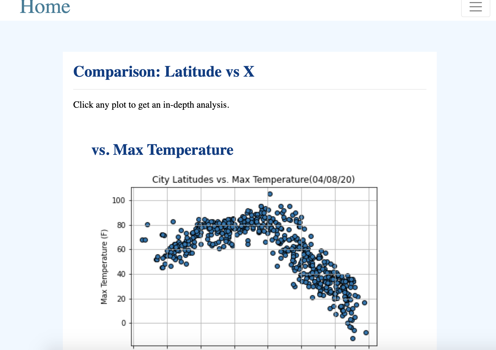
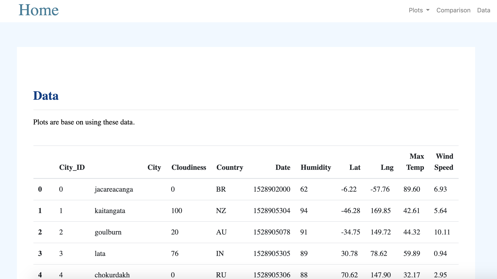

# Web Visualization Dashboard (Latitude)

## Goal

Using HTML and CSS to create a dashboard to showing the analysis that done for latitude data.

#### Landing page

Large screen:

Small screen:

#### Comparisons page

Large screen:

Small screen:

#### Data page

Large screen:

#### Visualization pages

Large screen:

#### Navigation menu

Large screen:

Small screen:

